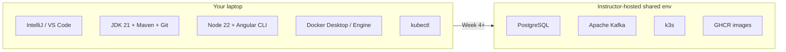

# Final lab environment — Java & Angular Fullstack

This course uses **instructor-hosted shared services** from Week 4 onward. Participants develop on their laptop. They do **not** install PostgreSQL, Kafka, or k3s locally.

**Stack (Option A — matches the Angular outline):**

| Shared service | Used from | Client on the laptop |
| -------------- | --------- | -------------------- |
| **PostgreSQL** | Week 4 (Labs 37–39, 50) | `psql` or another SQL client (optional) |
| **Apache Kafka** | Week 4 (Labs 30–32, 46, 49) | Bootstrap 100.22.136.97:9092. No Kafka install on the laptop. |
| **k3s** | Week 5 (Labs 42, 51) | `kubectl` + instructor login / kubeconfig |
| **GitHub Actions + GHCR** | Week 5 (Labs 43–44, 51) | GitHub account |

CI/CD is **GitHub Actions** with code scanning. **Do not** use Bitbucket Pipelines.

Connection details (host, service name, username, password, `kubectl`) are handed out by the instructor. **Never commit** passwords, kubeconfigs, or `.env` files.

Install **Docker Desktop** on the laptop in [Lab 0 Step 11](Week%201%20-%20Java%20and%20JVM%20Foundations/module-00/lab0/LAB-0-GUIDE.md) ([Windows](Week%201%20-%20Java%20and%20JVM%20Foundations/module-00/lab0/LAB-0-WINDOWS.md#step-11--install-docker-desktop) · [macOS](Week%201%20-%20Java%20and%20JVM%20Foundations/module-00/lab0/LAB-0-MACOS.md#step-11--install-docker-desktop)). It does not replace the shared k3s cluster.

Reachability requires the class IP allowlist (or instructor VPN).
